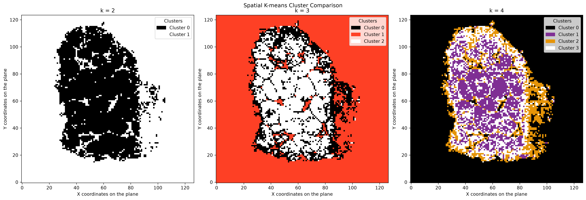
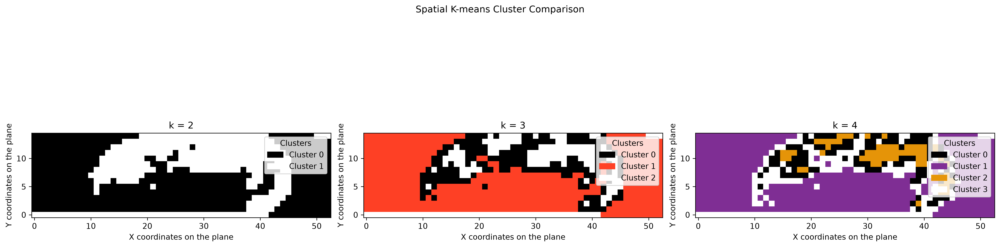
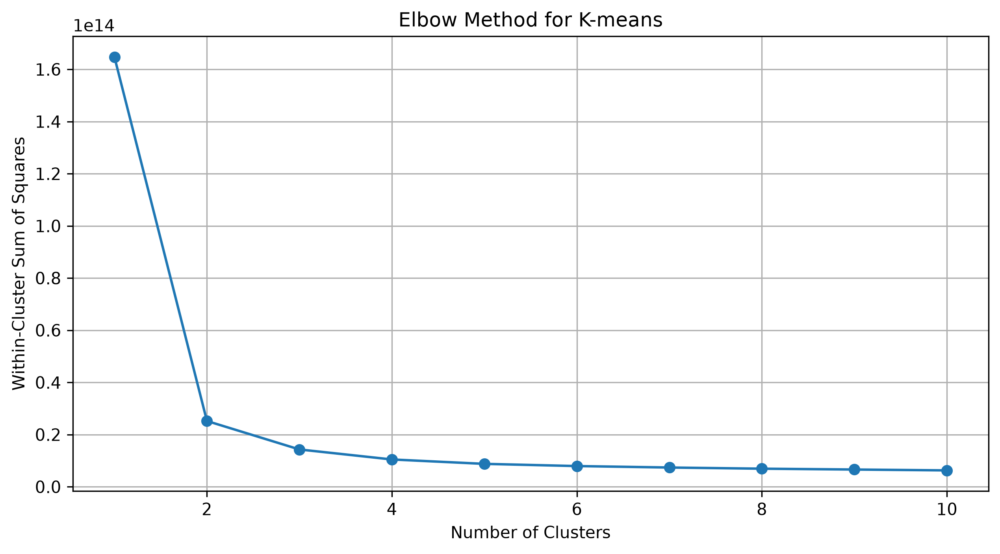
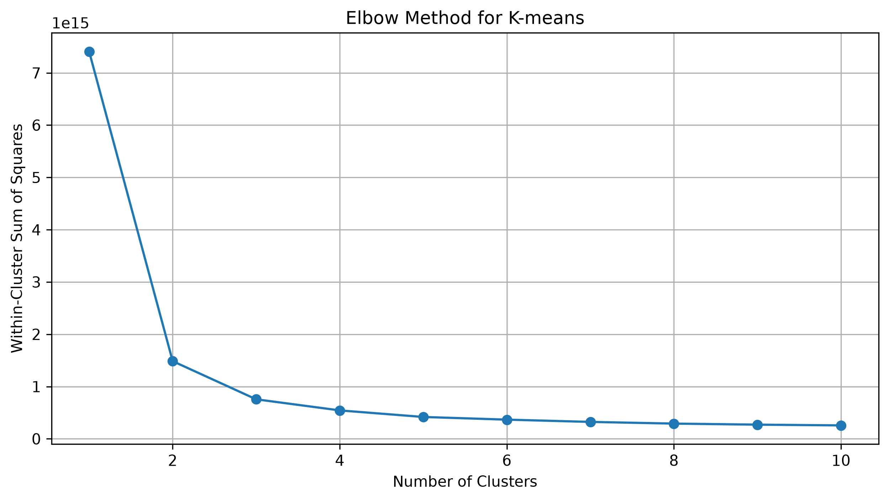
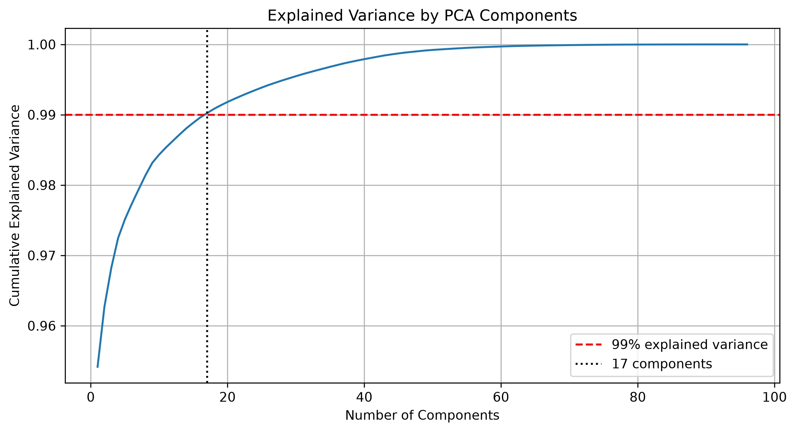
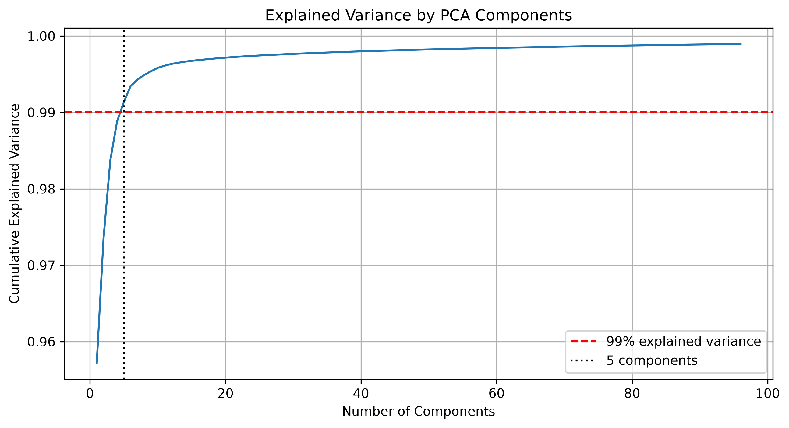
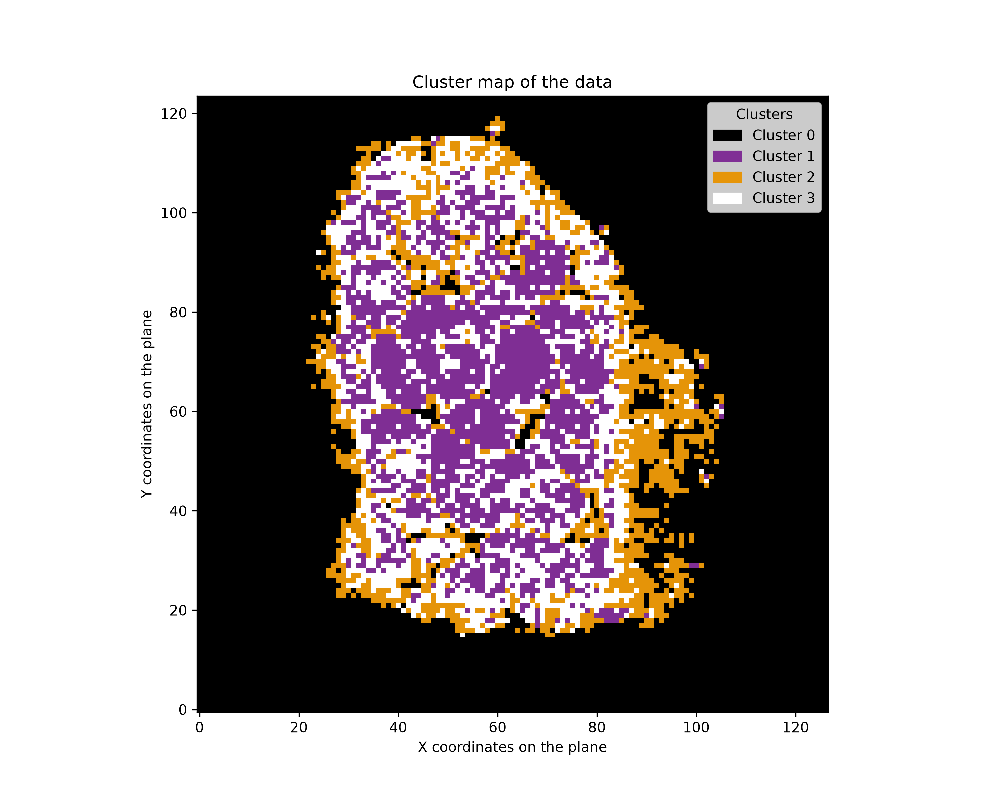
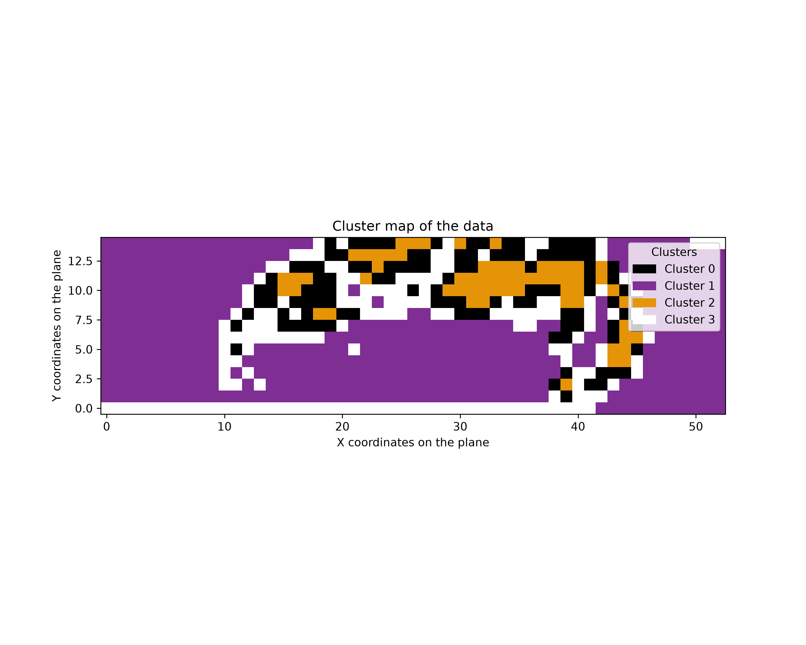

# DESI-MSI Clustering

[](https://github.com/LittleBigPluton/desi-msi-clustering/actions/workflows/ci.yml)


Unsupervised spatial segmentation of DESI mass spectrometry imaging data using PCA and K-means clustering, with quantitative cluster evaluation and stability analysis.

The project converts high-dimensional MSI measurements into spatial cluster maps without relying on manually annotated tissue labels. It includes format-specific preprocessing, adaptive PCA dimensionality reduction, deterministic K-means clustering, internal validation metrics, cross-seed stability analysis and spatial comparison of candidate cluster resolutions.

---

## Results at a Glance

The pipeline was evaluated on two DESI-MSI datasets with substantially different dimensionalities and raw export structures.

| Dataset | Spatial observations | Molecular features | PCA components retained | Selected k | Silhouette | Davies-Bouldin | Mean ARI stability |
| --- | ---: | ---: | ---: | ---: | ---: | ---: | ---: |
| Sample 1 | 15,748 | 98 | 17 | 4 | 0.706 | 0.815 | 0.998 |
| Sample 2 | 750 | 3,000 | 5 | 4 | 0.654 | 0.733 | 0.999 |

PCA components are selected automatically to retain at least **99% cumulative explained variance**.

The final `k=4` solutions are highly reproducible across random initializations, with mean Adjusted Rand Index values of approximately **0.998** for Sample 1 and **0.999** for Sample 2.

### Spatial resolution comparison

#### Sample 1



#### Sample 2



The comparison illustrates how increasing the number of clusters from `k=2` to `k=4` progressively resolves additional spatially coherent spectral regions rather than merely fragmenting the samples into arbitrary labels.

> **Interpretation:** Cluster labels represent unsupervised spectral/spatial partitions. Without external histological ground truth, they should not be interpreted as validated biological tissue classes.

---

## Why `k = 4`?

The number of clusters is treated as an **exploratory segmentation resolution**, not as a known biological class count.

No single internal clustering metric identifies `k=4` as the universal mathematical optimum. In fact, the internal metrics generally favor coarser partitions.

For Sample 1:

- `k=2` gives the highest silhouette score and Calinski-Harabasz score and the lowest Davies-Bouldin index.
- `k=3` introduces additional structure but remains a relatively coarse segmentation.
- `k=4` provides a finer spatial partition while maintaining strong cluster separation and extremely high cross-seed stability.

For Sample 2:

- `k=2` gives the strongest silhouette and Davies-Bouldin scores.
- `k=3` gives the highest Calinski-Harabasz score.
- `k=4` remains well separated and highly stable while resolving additional spatially coherent regions.

The elbow curves provide another part of the evidence.





The strongest inertia reduction occurs at low values of `k`, as expected. Across the meaningful multi-cluster range (`k=2–10`), however, the reduction in inertia begins to show diminishing returns around `k=4`.

The spatial comparison is therefore an important part of the decision. In both datasets:

- `k=2` primarily captures a coarse large-scale partition;
- `k=3` begins to resolve additional internal structure;
- `k=4` preserves the broad spatial organization while separating further spatially coherent spectral regions.

The selected `k=4` solutions are also extremely reproducible across random initializations:

```text
Sample 1
mean ARI: 0.9983
min ARI:  0.9967
max ARI:  1.0000

Sample 2
mean ARI: 0.9986
min ARI:  0.9972
max ARI:  1.0000
```

These stability values indicate that the additional subdivision at `k=4` is not simply a consequence of unstable K-means initialization.

For this reason, **four clusters are retained as the working exploratory segmentation resolution**. The choice balances:

- inertia reduction;
- internal cluster quality;
- spatial coherence;
- additional segmentation detail;
- and cross-seed reproducibility.

It should therefore be interpreted as a **defensible exploratory resolution**, not as proof that the samples contain exactly four biological tissue classes.

---

## Workflow

```text
Raw DESI-MSI data
        │
        ▼
Format-specific preprocessing
        │
        ▼
Canonical spatial feature matrix
(X, Y, molecular intensities)
        │
        ▼
Initial PCA decomposition
        │
        ▼
Automatic component selection
≥ 99% cumulative explained variance
        │
        ▼
Reduced PCA feature space
        │
        ├───────────────┐
        ▼               ▼
Elbow analysis      Candidate k evaluation
                    Silhouette
                    Davies-Bouldin
                    Calinski-Harabasz
        │               │
        └───────┬───────┘
                ▼
        K-means clustering
                │
                ▼
      Cross-seed ARI stability
                │
                ▼
       Spatial cluster maps
```

The pipeline uses a fixed random state for reproducibility and evaluates clustering stability across multiple random initializations.

---

## Format-Specific Preprocessing

The two datasets do not share the same raw export structure, so they require different cleaning procedures before they can be analyzed through the same clustering pipeline.

The preprocessing layer therefore preserves two dedicated cleaning paths.

```text
Raw format A
    │
    └── format-specific cleaning ──┐
                                   │
                                   ▼
                         X, Y, molecular features
                                   ▲
                                   │
Raw format B                       │
    │                              │
    └── format-specific cleaning ──┘
```

After preprocessing, both datasets are converted into the same canonical representation:

```text
X | Y | molecular intensity features
```

For the current datasets:

```text
Sample 1
100 total columns
= X + Y + 98 molecular features

Sample 2
3002 total columns
= X + Y + 3000 molecular features
```

This allows the downstream PCA, clustering, evaluation and visualization logic to operate consistently despite differences in the original data exports.

---

## PCA Dimensionality Reduction

MSI data can contain hundreds or thousands of molecular-intensity features per spatial observation.

PCA is initially computed using up to:

```python
total_components = 96
```

The minimum number of components required to retain the configured explained-variance threshold is then selected automatically:

```python
explained_variance_threshold = 99
```

For the two included datasets:

```text
Sample 1 → 17 PCA components
Sample 2 →  5 PCA components
```

### Explained Variance

#### Sample 1



#### Sample 2



---

## Clustering Evaluation

Candidate K-means solutions are evaluated across:

```text
k = 2 ... 10
```

using three internal clustering metrics together with cross-seed stability analysis.

| Metric | Interpretation |
| --- | --- |
| Silhouette score | Higher indicates stronger within-cluster cohesion and between-cluster separation |
| Davies-Bouldin index | Lower indicates better-separated clusters |
| Calinski-Harabasz score | Higher indicates stronger separation relative to within-cluster dispersion |
| Adjusted Rand Index | Measures agreement between clustering solutions generated from different random initializations |

Full metric tables are stored in:

```text
reports/
├── sample_1_clustering_metrics.csv
└── sample_2_clustering_metrics.csv
```

### Sample 1

| k | Silhouette | Davies-Bouldin | Calinski-Harabasz |
| ---: | ---: | ---: | ---: |
| 2 | 0.799 | 0.349 | 87,163 |
| 3 | 0.740 | 0.671 | 82,844 |
| 4 | 0.706 | 0.815 | 77,386 |

### Sample 2

| k | Silhouette | Davies-Bouldin | Calinski-Harabasz |
| ---: | ---: | ---: | ---: |
| 2 | 0.740 | 0.420 | 2,982 |
| 3 | 0.694 | 0.622 | 3,287 |
| 4 | 0.654 | 0.733 | 3,139 |

The tables make the trade-off explicit: coarser clusterings score better on several geometric criteria, while `k=4` provides additional spatial resolution and remains quantitatively strong and highly reproducible.

For `k=4`, the stability analysis produced:

```text
Sample 1
mean ARI: 0.9983
min ARI:  0.9967
max ARI:  1.0000

Sample 2
mean ARI: 0.9986
min ARI:  0.9972
max ARI:  1.0000
```

These values indicate that the selected segmentation is highly reproducible with respect to K-means initialization.

---

## Final Cluster Maps

### Sample 1



### Sample 2



Cluster IDs are arbitrary K-means labels and do not imply correspondence between cluster number and biological identity.

---

## Installation

### Requirements

- Python 3.12 or 3.13

Clone the repository:

```bash
git clone https://github.com/LittleBigPluton/desi-msi-clustering.git
cd desi-msi-clustering
```

Create and activate a virtual environment:

```bash
python3 -m venv venv
source venv/bin/activate
```

Install the package:

```bash
python -m pip install --upgrade pip
pip install -e .
```

For development:

```bash
pip install -e ".[dev]"
```

---

## Usage

Run the complete example workflow with:

```bash
desi-msi-clustering
```

The command performs:

```text
format-specific preprocessing
→ PCA reduction
→ candidate clustering evaluation
→ spatial comparison
→ stability analysis
→ final K-means clustering
→ figure and report generation
```

Main analysis parameters are defined in:

```text
src/msi_clustering/config.py
```

Current defaults include:

```python
total_components = 96
explained_variance_threshold = 99

n_clusters = 4
minimum_clusters = 2
maximum_clusters = 10
random_state = 0

comparison_clusters = (2, 3, 4)
stability_random_states = (0, 1, 2, 3, 4)
```

---

## Expected Data Representation

After preprocessing, each observation represents one spatial MSI measurement:

```text
X       Y       m/z_1       m/z_2       ...       m/z_n
0.0     0.0     120.4       84.1                  15.8
0.0     1.0      98.7       91.3                  11.2
...
```

where:

- `X` and `Y` identify the spatial measurement location;
- molecular columns contain ion-intensity measurements;
- each row represents one spatial observation.

The preprocessing module currently supports the two export layouts used by the example datasets:

- transposed MSI feature tables;
- tab-separated MSI exports.

---

## Project Structure

```text
desi-msi-clustering/
├── .github/
│   └── workflows/
│       └── ci.yml
│
├── data/
│   ├── raw/
│   └── processed/
│
├── figures/
│   └── comparison/
│
├── reports/
│   ├── sample_1_clustering_metrics.csv
│   └── sample_2_clustering_metrics.csv
│
├── src/
│   └── msi_clustering/
│       ├── __init__.py
│       ├── clustering.py
│       ├── config.py
│       ├── evaluation.py
│       ├── pipeline.py
│       ├── processing.py
│       └── visualization.py
│
├── tests/
│   ├── test_clustering.py
│   ├── test_evaluation.py
│   ├── test_processing.py
│   └── test_visualization.py
│
├── LICENSE
├── README.md
└── pyproject.toml
```

---

## Code Quality

The repository includes automated unit testing, linting, static type checking and continuous integration.

Local checks:

```bash
ruff check .
mypy
pytest -v
```

Current test suite:

```text
17 tests passing
```

GitHub Actions runs the quality checks on:

```text
Python 3.12
Python 3.13
```

Ruff is used for linting only; source formatting is intentionally not enforced by the CI workflow.

---

## Data Provenance

This repository contains two DESI-MSI example datasets used to demonstrate the preprocessing and clustering workflow.

- **Sample 1:** Public DESI-MSI dataset  
  **Source:** [METASPACE - Emrys Jones](https://metaspace2020.org/annotations?grp=5727e83d-e1dd-11e8-9d75-ff97c45816a5&ds=2019-10-21_09h57m26s&q=liver&cols=3,5&sort=mz)

- **Sample 2:** Dataset obtained during an internship

The datasets are used for unsupervised methodological demonstration. No manually annotated tissue labels are used as clustering targets.

---

## Limitations

This project performs exploratory unsupervised segmentation.

Important limitations include:

- no manually annotated tissue ground truth is used;
- internal clustering metrics measure geometric properties rather than biological correctness;
- cluster IDs have no inherent biological meaning;
- `k=4` is a working exploratory spatial resolution rather than a universally optimal number of tissue classes;
- preprocessing currently targets the example MSI export formats included in the repository.

External histology or expert annotations would be required to validate whether individual clusters correspond to specific biological tissue structures.

---

## Technologies

Python · NumPy · pandas · scikit-learn · Matplotlib · PCA · K-means · pytest · Ruff · mypy · GitHub Actions

---

## License

This project is licensed under the [MIT License](LICENSE).
